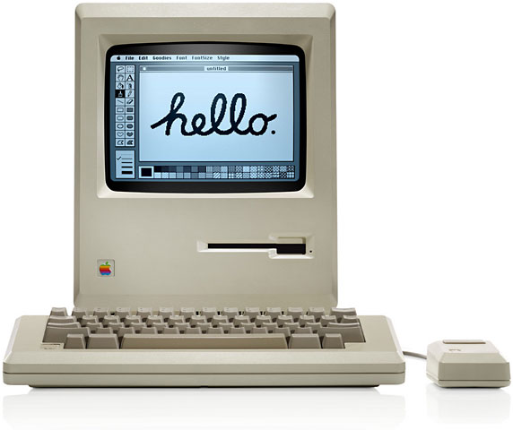
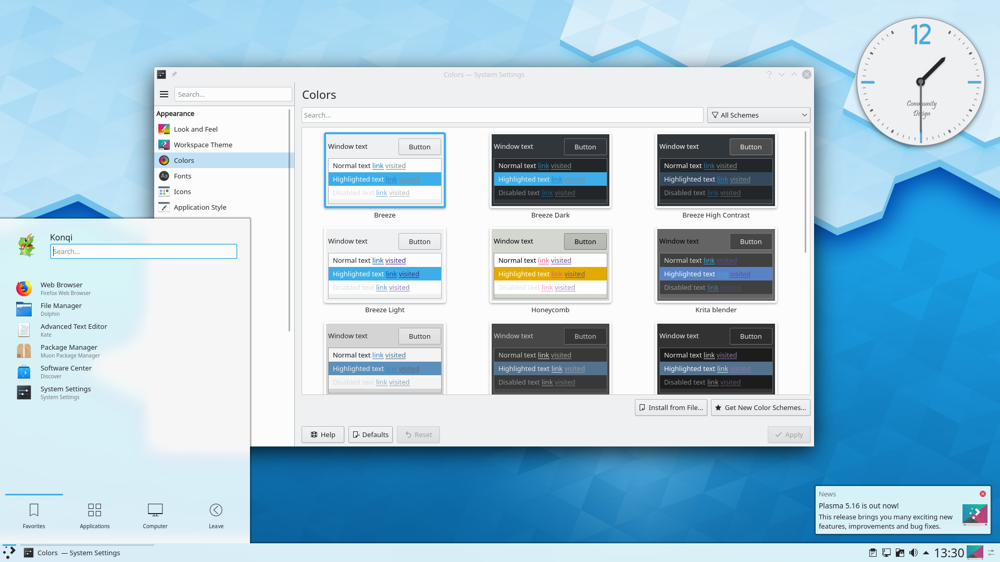

# X11 vs Wayland

- [X11 vs Wayland](#x11-vs-wayland)
  * [Introduction](#introduction)
  * [X Window System](#x-window-system)
    + [Introduction](#introduction-1)
      - [Terminologies](#terminologies)
    + [Origine et objectifs](#origine-et-objectifs)
    + [Fonctionnement](#fonctionnement)
      - [Description d'un workflow classique](#description-d-un-workflow-classique)
    + [X Server - Xorg](#x-server---xorg)
      - [Device Independent X - DIX](#device-independent-x---dix)
      - [Device Dependent X - DDX](#device-dependent-x---ddx)
    + [Limites](#limites)
      - [Interface utilisateur](#interface-utilisateur)
      - [Client-serveur](#client-serveur)
  * [Wayland](#wayland)
    + [Introduction](#introduction-2)
    + [Objectifs](#objectifs)
    + [Fonctionnement](#fonctionnement-1)
    + [Rendu direct](#rendu-direct)
    + [Programmation](#programmation)
  * [Comparaison](#comparaison)
  * [Sources](#sources)

<small><i><a href='http://ecotrust-canada.github.io/markdown-toc/'>Table of contents generated with markdown-toc</a></i></small>


---

|          X11           |          Wayland          |
| :--------------------------: | :---------------------: |
|  |  |

## Introduction

Dans le cadre du cours de Unix, nous avons choisi de réaliser un article comparatif de X11 et Wayland. Tout deux sont des protocoles qui spécifient la communication entre le serveur d'affichage et le client/poste de travail.

Autrement dit, ces protocoles ont permis d'implémenter des **interfaces graphiques** (GUI: Graphical User Interface) facilitant grandement l'intéraction Homme-Machine, pour les systèmes Unix.

De nombreux systèmes d'affichage ont précédé les protocoles présentés ici. Des GUI étaient déjà présent sur des machines tels que: [Alto](https://www.wikiwand.com/en/Xerox_Alto), [Star](https://www.wikiwand.com/en/Xerox_Star) ou [Macintosh](https://www.wikiwand.com/en/Macintosh).

|          Macintosh           |          Xerox          |
| :--------------------------: | :---------------------: |
|  |  |

---

Nous allons donc étudier le protocole le plus utilisé de nos jours **X**, puis nous allons voir en quoi **Wayland** est une alternative intéressante.

## X Window System

### Introduction

**X ou X Window System**, est un protocole ou framework, mettant en place une architecture particulière permettant d'implémenter des GUI sur les systèmes Unix. X11 est la onzième version de ce protocole.

#### Terminologies

- **X ou X Window System** : désigne le protocole ou framework de base qui permet de mettre en place une GUI.
- **X11** : 11ème version de X.
- **Xorg** : implémentation du serveur d'affichage (X Server) utilisé dans le framework X.
- **Xlib & Xcb** : librairies côté client écrites en C permettant d'intéragir facilement avec le X Server.

### Origine et objectifs

X est un idée qui a émergé au [MIT](https://www.wikiwand.com/en/MIT_Laboratory_for_Computer_Science) en 1984. Durant cette période le [MIT](https://www.wikiwand.com/en/MIT_Laboratory_for_Computer_Science), la [DEC](https://www.wikiwand.com/en/Digital_Equipment_Corporation) et [IBM](https://www.wikiwand.com/en/IBM) développait le **Projet Athena** à des fins éducatives. Cette plateforme permettrait aux étudiants d'avoir un accès partagé aux ressources informatiques. Elle avait donc besoin d'avoir une interface graphique indépendante pour fonctionner sur les différents systèmes (IBM vs DEC), tout en comportant un système de _fenêtres_.

Pour répondre à ce problème d'incompatibilité, les personnes en charges du projet ont créé un protocole qui permettait de lancer des applications en locales tout en appelant des ressources externes. De plus, à la même époque un protocole similaire existait déjà : le **W Window System**, qui était synchrone. _Bob Scheifler_ du MIT s'est fortement inspiré de ce protocole, en le rendant asynchrone, X était né.


L'objectifs était donc de créer :

- Une **interface graphique** comportant un système de fenêtres
- fonctionnelle sur les différents systèmes et **indépendant du hardware**
- permettant une **intéraction avec les périphériques** (souris, clavier, écran tactile,...)



### Fonctionnement

X utilise un model *client-serveur*. Le serveur (X Server) communique avec différents clients (X client), qui représentent les applications qui sont lancés sur la machine. Le serveur reçoit des requêtes pour ensuite réaliser un rendu graphique et peut aussi recevoir des *inputs* (evdev) de l'utilisateur, venant des périphériques, pour les renvoyer vers les clients.

Voici donc les 4 parties d'une architecture X :
- **KMS** (Kernel Mode Setting: responsable de l'affichage), **evdev** (interface/driver des évènements sur Linux), **Kernel** (noyau Linux)
- **X Server**
- **X client**
- **Compositor**


#### Description d'un workflow classique

1. Le Kernel reçoit un *input* et l'envoie au X Server en utilisant le driver *evdev* responsable des évènements.
2. Le X Server détermine quelle fenêtre est impacté par l'évènement et l'envoie au X client concerné.
3. Le X client traite l'évènement et choisi quelle(s) action(s) doivent être effectuées. Par exemple une checkbox a été cliqué et on doit donc changer l'affichage de cette dernière. Suite à cela le client envoie une requête d'affichage au serveur.
4. Quand le X Server reçoit cette requête, il l'a redirige vers le driver spécifique afin de réaliser les changements voulu en s'appuyant sur le hardware. Le serveur va aussi calculer la zone de délimitation du rendu et envoie ces informations au *compositor*.
5. Les informations reçu par le *compositor* lui indique qu'un changement a été réalisé sur la fenêtre et qu'il doit donc changer la partie visible de cette fenêtre. Le composeur est responsable de l'affichage de l'ensemble de l'écran, en fonction d'un scénario prédéfini et des informations reçues, envoyé par les clients. Il doit quand même repasser par le serveur pour réaliser l'affichage.
6. Le X Server reçoit les informations du *compositor* et met à jour le tampon. Il doit aussi tenir compte des fenêtres qui se chevauchent pour savoir s'il doit ou non retourner les changements. Les informations sont transmises au KMS qui est un sous module du DRM (Direct Rendering Manager), en charge de l'affichage (en lien avec les cartes graphiques). Le KMS gère alors la pipeline d'affichage.

---

Le fonctionnement du protocol reste global en ne faisant aucune spécification sur le design que les interfaces peuvent prendre. Le design peut être géré à plusieurs niveaux :
- ***Desktop environments*** (environnement de bureau) : désigne l'aspect global, le design, du bureau. Les plus connus sont **GNOME**, **KDE**, **Xfce**.
- ***Window managers*** (gestionnaire de fenêtres) : les environnements de bureaux possèdent en principe un gestionnaire de fenêtre par défaut. **KWin** pour KDE, **Metacity** pour GNOME 2. Mais il en existe d'autres plus légers et indépendants comme **i3** ou **awesome** (ci-dessous).


### X Server - Xorg

X Server est donc la pierre angulaire de ce framework X11. C'est lui qui est au milieu des intéraction entre l'utilisateur, le client et le composeur.

L'implémentation actuelle de ce serveur, est nommée **Xorg**.
Elle a été écrite en C, avec une licence FOSS (Free and Open Source Software) et est maintenue par la [Xorg Foundation](https://www.wikiwand.com/en/X.Org_Foundation).

Il existe des librairies C, dîtes *client*, qui permettent d'intéragir plus facilement avec le server Xorg tel que **Xlib** ou **Xcb**. À savoir qu'il existe aussi de nombreux *bindings* permettant d'utiliser d'autres languages comme Python.

L'implémentation principale (hors extension) se divise en deux parties.

#### Device Independent X - DIX

Cette partie est indépendante car elle ne va pas intéragir avec le hardware. Elle va intéragir avec les clients et implémenter les rendus des applications. Elle est la partie la plus importante de Xorg.

#### Device Dependent X - DDX

Cette partie est dépendante car elle intéragie avec le hardware. Le hardware désigne aussi bien les cartes graphiques, que les périphériques (souris, clavier, etc...). Chaque partie du hardware possède son driver, et est implémenté sous forme de module.

---

Un driver qui nous intéresse est le ***2D graphics driver***.

Pour des raisons historiques Xorg possède toujours un driver pour les rendus graphique en 2D. En effet auparavant, c'est Xorg qui s'en occupait. Cette fonctionnalité a été déplacé dans le DRM, avec la nouvelle approche : le KMS (cf. étape 6 du workflow), présent dans le noyau Linux.

### Limites

X11 et Xorg sont présents et utilisés par défaut sur quasiment toutes les distributions Linux.
Malgré tout X possèdent plusieurs points faibles voir même des problèmes qui poussent les développeurs à se demander si X est le système de fenêtre optimal.

#### Interface utilisateur

Du fait qu'il n'existe aucun guide sur comment développer une interface utilisateur au sein de X (cf. Description d'un workflow classique), il en résulte une vaste variété d'interfaces différentes. Cela a créé des problèmes de communications entre les clients. Il existe une convention appelée [ICCCM](https://www.wikiwand.com/en/Inter-Client_Communication_Conventions_Manual) (Inter-Client Communication Conventions Manual) qui spécifie les modalités pour permettre l'interopérabilité des clients, mais est difficile à mettre en place.

Au final chaque environnement de bureau possède ses propres règles.

#### Client-serveur

Comme expliqué dans la partie **Device Dependent X (DDX)**, avec l'example du driver de rendu graphique 2D, auparavant beaucoup de modules et donc de traitements étaient effectués dans le X Server (Xorg). Cependant de nos jours la plupart de ces modules sont implémentés directement dans le noyau Linux ou dans des librairies présentes par défaut.

Le X Server ne fait donc pas grand chose. Il représente une étape supplémentaire, qui permet de faire passer les requêtes aux bons composants. On note que cette étape supplémentaire augmente la compléxité du framework X.

De plus, c'est le *compositor* qui prend les décisions finales quant à l'affichage. On se pose donc la question du véritable intérêt du serveur (tout du moins dans cette organisation), et de l'intérêt de la séparation du serveur et du composeur, qui prend une grande partie des décisions.

## Wayland

### Introduction

Wayland est un **protocole informatique** qui spécifie la communication entre un serveur d'affichage et ses clients, ainsi qu'une implémentation du protocole dans le langage de programmation C.

Le projet _Wayland_ développe également une interface de référence pour un compositeur Wayland qui se nomme Weston.

### Objectifs

L'objectif principal de Wayland est de remplacer le système X Window par un système de fenêtrage moderne, plus simple, sous Linux et d'autres systèmes d'exploitation de type Unix. Le code source du projet est publié selon les termes de la licence MIT, une licence de logiciel libre permissive.

### Fonctionnement

Le fonctionnement de _Wayland_ se fait entre 3 parties :

- **KMS, evdev, Kernel**
- **Le compositeur de Wayland**
- **Les clients (programmes, applications)**


Le noyau va obtenir des évènements provenant soit du _hardware_ soit des _inputs_ (clavier,etc...) et l'envoyer au compositeur. C'est le même fonctionnement qu'avec X Window, çela nous évite de redéfinir les pilotes d'entrée dans le noyau.

Le **compositeur** examine son **environnement** pour déterminer quelle fenêtre doit recevoir l'événement. L'environnement correspond à ce qui est à l'écran et le compositeur comprends les transformations qu'il peut appliquer aux éléments de l'environnement. Ainsi, le compositeur peut choisir la bonne fenêtre et transformer les coordonnées d'écran en coordonnées locales de fenêtre, en appliquant les transformations inverses. Les types de transformation qui peuvent être appliqués à une fenêtre sont uniquement limités à ce que le compositeur peut faire, tant qu'il peut calculer la transformation inverse pour les événements d'entrée.

Comme dans le cas X, lorsque le client reçoit l'événement, il met à jour l'interface utilisateur. Mais dans le cas de Wayland, le rendu se produit dans le client (**c.f : Rendu direct**), et le client envoie simplement une demande au compositeur pour indiquer la région qui a été mise à jour.
Le compositeur recueille les **demandes de dommages _(damage requests)_** de ses clients et recompose ensuite l'écran. Le compositeur peut alors directement émettre un **ioctl _(input-output control)_** pour planifier un saut de page avec **KMS**.

### Rendu direct

Avec le rendu direct, le client et le serveur partagent un tampon de mémoire vidéo. Le client se connecte à une bibliothèque de rendu comme **OpenGL** qui sait comment programmer le matériel et effectue le rendu directement dans la mémoire tampon. Le compositeur peut à son tour prendre la mémoire tampon et l'utiliser comme texture lorsqu'il compose le bureau. Après la configuration initiale, le client doit seulement indiquer au compositeur quel tampon utiliser et quand et où il a rendu le nouveau contenu dans celui-ci.

### Programmation

Il est possible de développer des compositeurs personalisés avec des lib tels que **Qt Wayland Compositor**.

Qt Wayland Compositor est un module qui fournit des **API QML et C++** pratiques et puissantes pour développer des compositeurs personnalisés basés sur le protocole Wayland. Rappelons que le **compositeur**, affiche le contenu des applications clientes qui supportent le protocole _Wayland_.

La philosophie de Wayland est de garder le protocole de base simple et minimal. Les développeurs peuvent ensuite développer ce protocole de base avec des extensions spécifiques à chaque cas d'utilisation. **Qt Wayland Compositor** prend en charge de nombreuses extensions courantes par défaut, et dispose également d'API permettant de créer de nouvelles extensions personnalisées.

|         Schéma plus détaillé          |
| :-----------------------------------: |
|  |

---

**Environnement de bureau supporté**

```
- GNOME 3.20+ (if specifically selected; X is used by default in Debian)
- KDE (Plasma 5.4)
- Enlightenment
- Hawaii
```

**Environnement de bureau non supporté**

```
- Cinnamon
- MATE
- XFCE
```

## Comparaison

On peut donc voir que Wayland a pour but de remplacer X en améliorant ses points faibles. Ce nouveau protocol réduit la complexité présente dans X en supprimant des étapes lors du traitement d'un *input*. En effet le *compositor* et le serveur ne font qu'un : **Weston**, cela d'améliorer les performances. 

Wayland permet une meilleure isolation entre les processus : une fenêtre ne peut pas accéder aux ressources d'une autre fenêtre, ni y injecter des frappes.

Wayland a également le potentiel d'être plus rapide, en réduisant la quantité de code entre les processus et le matériel, en déléguant beaucoup de choses aux processus eux-mêmes (utilisation des librairies du noyaux Linux).

## Sources

[wayland-vs-xorg](https://www.secjuice.com/wayland-vs-xorg/)
[Xorg/wiki](https://www.x.org/wiki/)
[Xorg server](https://www.wikiwand.com/en/X.Org_Server)
[X Window System](https://www.wikiwand.com/en/X_Window_System)
[Wayland](https://wayland.freedesktop.org/)
